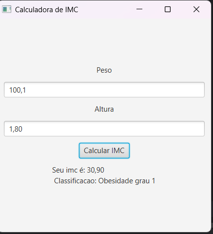

Calculadora de IMC - 

Este projeto é uma aplicação desktop feita em Java usando JavaFX para calcular o Índice de Massa Corporal (IMC) do usuário.

A interface permite que o usuário insira o peso (em kg) e a altura (em metros). Ao clicar no botão "Calcular IMC", o programa calcula o IMC e exibe o resultado junto com a classificação correspondente:

- Abaixo do peso
- Peso normal
- Sobrepeso
- Obesidade grau 1
- Obesidade grau 2
- Obesidade grau 3 (mórbida)

O programa trata entradas inválidas, mostrando uma mensagem para o usuário.

Tecnologias utilizadas

- Java
- JavaFX (para interface gráfica)

